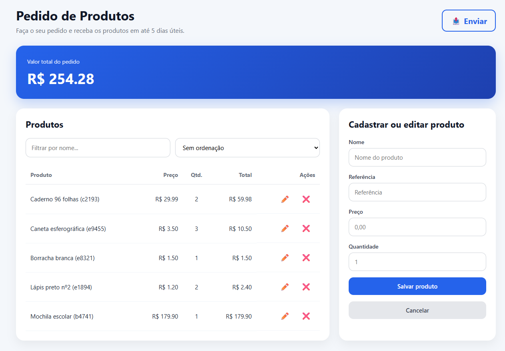

# Atividade prática — Manipulação de Arrays

## Objetivo

Nesta atividade, você deverá completar os trechos indicados no arquivo JavaScript para implementar funcionalidades de uma aplicação de pedidos de produtos.

A aplicação possui uma lista de produtos exibida em uma tabela HTML e permite:

- filtrar produtos;
- ordenar produtos;
- cadastrar novos produtos;
- editar produtos;
- excluir produtos;
- calcular o valor total do pedido;
- gerar um JSON simulando o envio do pedido para uma API.

 

# Questões

## Questão 1 — Renderização dos produtos

Na função `renderProductsTable()`, utilize o método `forEach()` para percorrer o array com os produtos já filtrados e ordenados.

Para cada produto:
- chame a função `createProductRow()`. Não esqueça de passar o produto como argumento!
- adicione a linha retornada ao corpo da tabela utilizando `append()`.

 

## Questão 2 — Cálculo do valor total

Ainda na função `renderProductsTable()`, utilize o método `reduce()` para calcular o valor total do pedido.

O cálculo deve considerar o valor total (preço * quantidade) de cada produto.

$$
totalValue = \sum (price \times quantity)
$$

 

## Questão 3 — Filtro por nome

Na função `filterProducts()`, utilize o método `filter()` para criar um novo array contendo apenas os produtos cujo nome inclui o termo digitado no campo de busca.

A busca deve ignorar diferenças entre letras maiúsculas e minúsculas.

 

## Questão 4 — Ordenação dos produtos

Na função `sortProducts()`, complete a estrutura `switch` utilizando o método `sort()` para ordenar os produtos conforme a opção selecionada.

Implemente as seguintes ordenações:
- nome crescente;
- nome decrescente;
- preço crescente;
- preço decrescente;
- quantidade crescente;
- quantidade decrescente;
- valor total crescente;
- valor total decrescente.

 

## Questão 5 — Localização do produto para exclusão

Na função `deleteProduct()`, utilize o método `findIndex()` para localizar o índice do produto que deverá ser removido do array.

A busca deve ser feita utilizando a propriedade `reference`.

 

## Questão 6 — Remoção do produto

Ainda na função `deleteProduct()`, utilize o método `splice()` para remover do array o produto localizado na questão anterior.

 

## Questão 7 — Verificação de referência duplicada

No evento de `submit` do formulário, utilize o método `some()` para verificar se já existe um produto com a mesma referência informada no formulário.

**Atenção:** durante a edição, o produto que está sendo editado não deve ser considerado como duplicado.

 

## Questão 8 — Cadastro de novo produto

Ainda no evento de `submit`, utilize o método `push()` para adicionar o novo produto ao array `products`.

 

## Questão 9 — Busca do produto para edição

Na função `editProduct()`, utilize o método `find()` para localizar o produto que será editado.

A busca deve ser feita utilizando a propriedade `reference`.

 

## Questão 10 — Geração dos itens do pedido

Na função `sendOrder()`, utilize o método `map()` para criar um novo array contendo apenas os dados necessários para o envio do pedido.

Cada item deve ser um objeto contendo:
- `reference`;
- `quantity`.

 

# Observações

- Não altere os nomes das funções já existentes.
- Utilize apenas os métodos solicitados em cada questão.
- Mantenha a estrutura geral do código fornecido.
- Observe a sequência do código para utilizar corretamente as variáveis já declaradas.